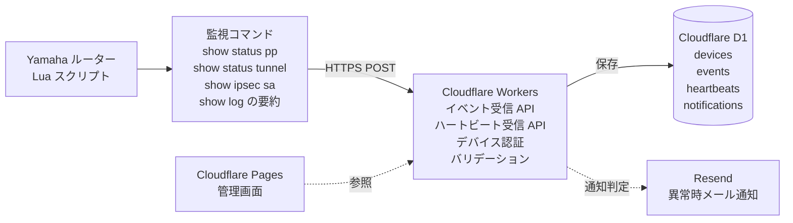

# yamaha-router-watch

# Yamaha Router Watch

Yamaha Router Watch は、Yamaha RTX / NVR 系ルーターを対象とした軽量な監視・見守りサービスの検証プロジェクトです。

Yamaha ルーター上で動作する Lua スクリプトから、WAN / VPN / IPsec / PPPoE などの状態変化や要約イベントを HTTPS POST で送信し、Cloudflare Workers で受信、Cloudflare D1 に保存します。

本プロジェクトでは、syslog の生データを外部へ転送するのではなく、ルーター側で要約したイベントのみを送信する設計を前提とします。

## 目的

小規模事業者や情シス担当者がいない顧客向けに、Yamaha ルーターの状態を低コストで見守る仕組みを構築することを目的とします。

主な目的は以下です。

- Yamaha ルーターの WAN / VPN 状態を定期確認する
- VPN 断、PPPoE 再接続、管理ログイン失敗などの重要イベントを検知する
- syslog 生データを外部に送らず、要約イベントのみを送信する
- 顧客LAN内に専用監視機器を置かずに運用する
- Cloudflare の無料枠を活用し、ランニングコストを最小化する
- 将来的に Coconala 等で提供できる月額見守りサービスの基盤にする

## 想定アーキテクチャ

