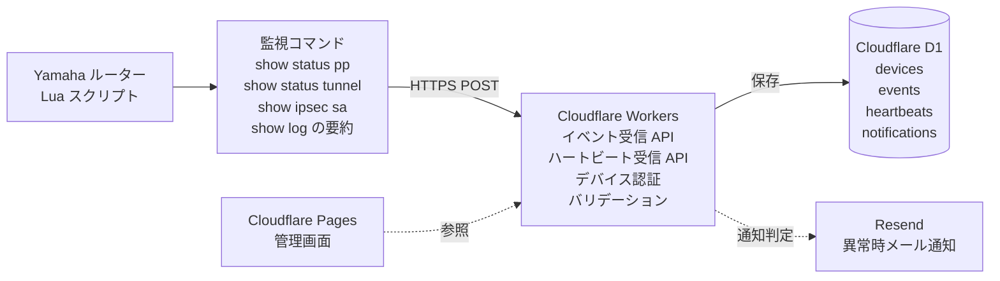

# yamaha-router-watch

# Yamaha Router Watch

Yamaha Router Watch は、Yamaha RTX / NVR 系ルーターを対象とした軽量な監視・見守りサービスの検証プロジェクトです。

Yamaha ルーター上で動作する Lua スクリプトから、WAN / VPN / IPsec / PPPoE などの状態変化や要約イベントを HTTPS POST で送信し、Cloudflare Workers で受信、Cloudflare D1 に保存します。

本プロジェクトでは、syslog の生データを外部へ転送するのではなく、ルーター側で要約したイベントのみを送信する設計を前提とします。

## 目的

小規模事業者や情シス担当者がいない顧客向けに、Yamaha ルーターの状態を低コストで見守る仕組みを構築することを目的とします。

主な目的は以下です。

- Yamaha ルーターの WAN / VPN 状態を定期確認する
- VPN 断、PPPoE 再接続、管理ログイン失敗などの重要イベントを検知する
- syslog 生データを外部に送らず、要約イベントのみを送信する
- 顧客LAN内に専用監視機器を置かずに運用する
- Cloudflare の無料枠を活用し、ランニングコストを最小化する
- 将来的に Coconala 等で提供できる月額見守りサービスの基盤にする

## 想定アーキテクチャ



## 現在の状態

Phase 1: Workers API MVP は完了済みです。

- Cloudflare Workers API 実装済み
- Cloudflare D1 migration 作成済み
- remote D1 への migration 適用確認済み
- deployed Workers で event / heartbeat の保存確認済み
- `source_ip` を観測情報として保存
- `scripts/` から疑似イベント送信可能

公開検証 URL:

```text
https://yamaha-router-watch-api.snow1606hawk.workers.dev
```

この URL は現在の検証用 Cloudflare アカウントに紐づくため、サービス専用 Cloudflare アカウントを作り直す場合は変更されます。

## ローカル開発

```bash
cd apps/api
npm install
cp wrangler.toml.example wrangler.toml
npm run d1:migrate:local
npm run dev
```

別ターミナルから:

```bash
bash scripts/send-test-event.sh
bash scripts/send-test-heartbeat.sh
curl http://localhost:8787/api/v1/events
curl http://localhost:8787/api/v1/heartbeats
```

ローカル D1 にテストデバイスがない場合は、以下を実行します。

```bash
cd apps/api
npx wrangler d1 execute yamaha-router-watch-db --local --command "INSERT OR IGNORE INTO devices (device_id, label, token_hash, enabled) VALUES ('test-rtx1210-001', '検証用 RTX1210', 'test-token', 1);"
```

## Cloudflare 環境の作り直し

サービス専用 Cloudflare アカウントで作り直す場合は、以下を実施します。

1. 専用アカウントで Cloudflare にログインする
2. D1 database を作成する
3. `apps/api/wrangler.toml` の `database_id` を新しい値に変更する
4. remote migration を適用する
5. テストデバイスを remote D1 に登録する
6. Workers を deploy する
7. 新しい Workers URL で送信テストを行う

コマンド例:

```bash
cd apps/api
npx wrangler d1 create yamaha-router-watch-db
npm run d1:migrate:remote
npx wrangler d1 execute yamaha-router-watch-db --remote --command "INSERT OR IGNORE INTO devices (device_id, label, token_hash, enabled) VALUES ('test-rtx1210-001', '検証用 RTX1210', 'test-token', 1);"
npm run deploy
```

deployed URL に対する確認:

```bash
API_BASE_URL=https://your-worker-url.example.workers.dev bash scripts/send-test-event.sh
API_BASE_URL=https://your-worker-url.example.workers.dev bash scripts/send-test-heartbeat.sh
curl https://your-worker-url.example.workers.dev/api/v1/events
curl https://your-worker-url.example.workers.dev/api/v1/heartbeats
```

`wrangler.toml` は環境依存値を含むためコミットしません。共有するのは `apps/api/wrangler.toml.example` だけです。
