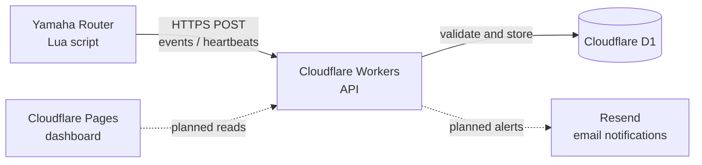
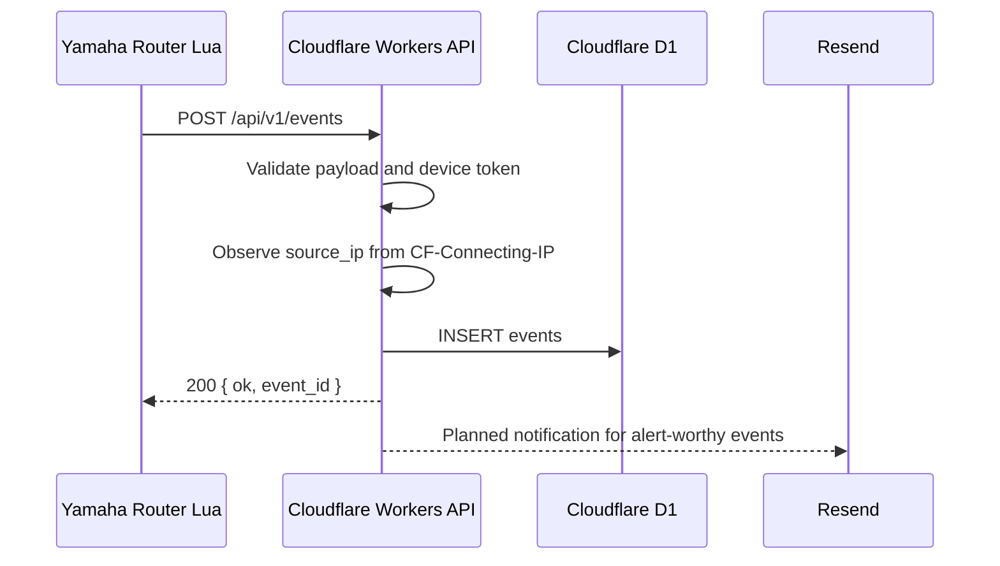
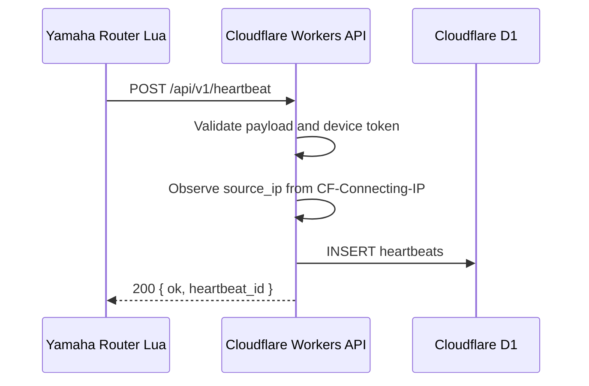

# Architecture

Yamaha Router Watch is a lightweight monitoring MVP for Yamaha RTX / NVR routers.

## Overview

The router sends summarized events and heartbeat snapshots. The service does not send raw syslog streams or full router configuration output.

## Components

- Yamaha Lua: runs on the router and converts router state into compact events.
- Cloudflare Workers: receives HTTPS API requests, validates payloads, authenticates devices, and writes to D1.
- Cloudflare D1: stores devices, events, heartbeats, and notification records.
- Resend: planned email notification provider for abnormal events.
- Cloudflare Pages: planned dashboard hosting target.

## Event Flow

1. Lua checks WAN, PPPoE, tunnel, IPsec, log, or environment status.
2. Lua detects a meaningful state change or alert-worthy condition.
3. Lua sends `POST /api/v1/events` with a summary event.
4. Workers validates the device token and payload.
5. Workers stores the event in D1.
6. Later phases will evaluate notification rules and send email.

## Heartbeat Flow

1. Lua periodically gathers a small status snapshot.
2. Lua sends `POST /api/v1/heartbeat`.
3. Workers validates the device token and payload.
4. Workers stores the heartbeat in D1.
5. Later phases will detect missing heartbeats.

## Design Principles

- Send summarized operational signals only.
- Avoid inbound access to customer LANs.
- Keep the MVP small enough to verify with `curl` before router testing.
- Keep device identity and token handling isolated in the API layer.
- Use Cloudflare free-tier friendly services where possible.
